# LABORATORIO #5:
### Integrantes: Wilcho dindo, Juanita Oramas

#### PARTE I

#### PARTE II

2. Revise qué valor tiene el parámetro ‘urlPatterns’ de la anotación @WebServlet, pues este indica qué URLs atiende las peticiones el servlet.
* Atiende las urls ```urlPatterns = "/helloServlet"```
3. Revise en el pom.xml para qué puerto TCP/IP está configurado el servidor embebido de Tomcat (ver sección de plugins).
* Está configurado en el puerto 8080 
4. Compile y ejecute la aplicación en el servidor embebido Tomcat, a través de Maven con:
```
 mvn package
 mvn tomcat7:run
 ```
5. Abra un navegador, y en la barra de direcciones ponga la URL con la cual se le enviarán peticiones al ‘SampleServlet’. Tenga en cuenta que la URL tendrá
como host ‘localhost’, como puerto, el configurado en el pom.xml y el path debe ser el del Servlet. Debería obtener un mensaje de saludo.
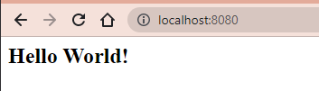

6. Observe que el Servlet ‘SampleServlet’ acepta peticiones GET, y opcionalmente, lee el parámetro ‘name’. Ingrese la misma URL, pero ahora agregando
un parámetro GET (si no sabe como hacerlo, revise la documentación en http://www.w3schools.com/tags/ref_httpmethods.asp).

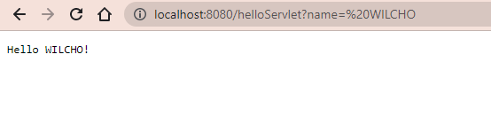
7. Busque el artefacto gson en el repositorio de maven y agregue la dependencia.
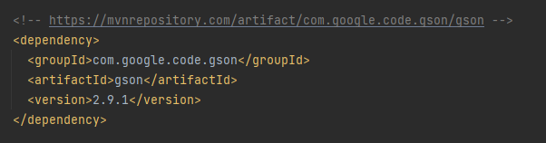
8. En el navegador revise la dirección https://jsonplaceholder.typicode.com/todos/1. Intente cambiando diferentes números al final del path de la url.
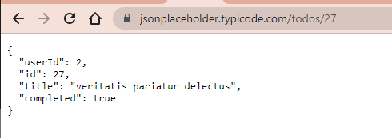

9.  Basado en la respuesta que le da el servicio del punto anterior, cree la clase edu.eci.cvds.servlet.model.Todo con un constructor vacío y los
    métodos getter y setter para las propiedades de los "To Dos" que se encuentran en la url indicada.
10. Utilice la siguiente clase para consumir el servicio que se encuentra en la dirección url del punto anterior:
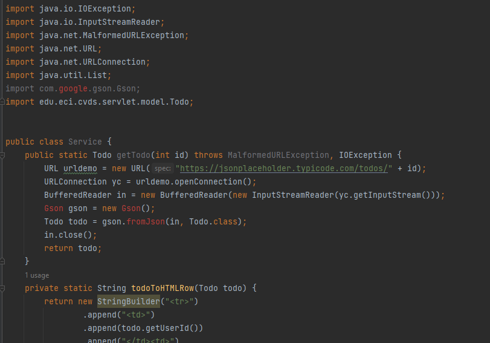
11. Cree una clase que herede de la clase HttpServlet (similar a SampleServlet), y para la misma sobrescriba el método heredado doGet. Incluya la
    anotación @Override para verificar –en tiempo de compilación- que efectivamente se esté sobreescribiendo un método de las superclases.
12. Para indicar en qué URL el servlet interceptará las peticiones GET, agregue al método la anotación @WebServlet, y en dicha anotación, defina la
    propiedad urlPatterns, indicando la URL (que usted defina) a la cual se asociará el servlet.

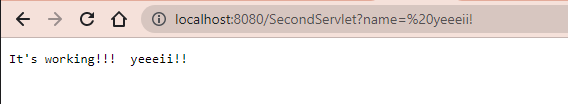

13. Teniendo en cuenta las siguientes métodos disponibles en los objetos ServletRequest y ServletResponse recibidos por el método doGet:

14. Una vez hecho esto, verifique el funcionamiento de la aplicación, recompile y ejecute la aplicación.
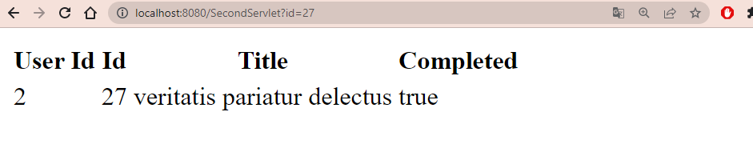
15. Intente hacer diferentes consultas desde un navegador Web para probar las diferentes funcionalidades.
* Pruebas exitosas:
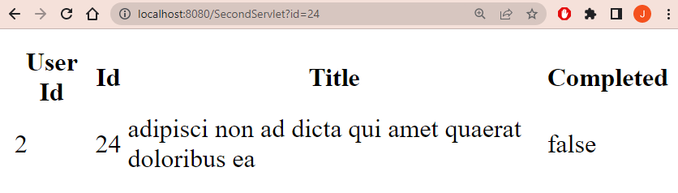
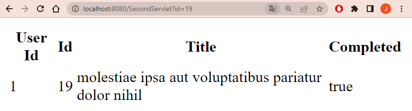

* Pruebas donde debería responder con error:
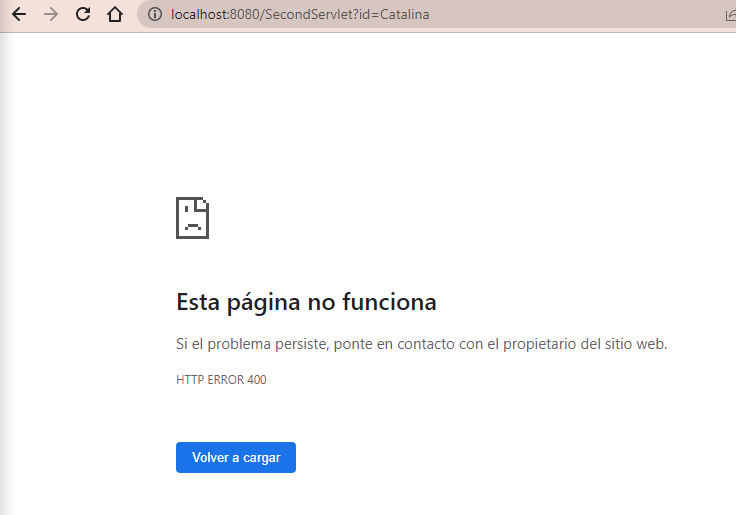
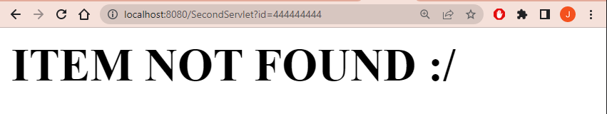

#### PARTE III
16. En su servlet, sobreescriba el método doPost, y haga la misma implementación del doGet.
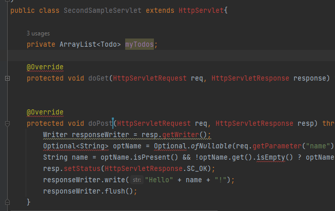
17. Cree el archivo index.html en el directorio src/main/webapp/index.html
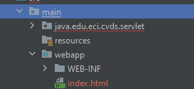
18. En la página anterior, cree un formulario que tenga un campo para ingresar un número (si no ha manejado html antes, revise
    http://www.w3schools.com/html/ ) y un botón. El formulario debe usar como método ‘POST’, y como acción, la ruta relativa del último servlet creado
    (es decir la URL pero excluyendo ‘http://localhost:8080/’).
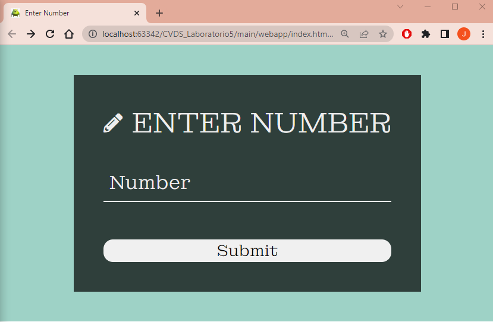
19. Revise este ejemplo de validación de formularios con javascript y agruéguelo a su formulario, de manera que -al momento de hacer ‘submit’- desde el
    browser se valide que el valor ingresado es un valor numérico.
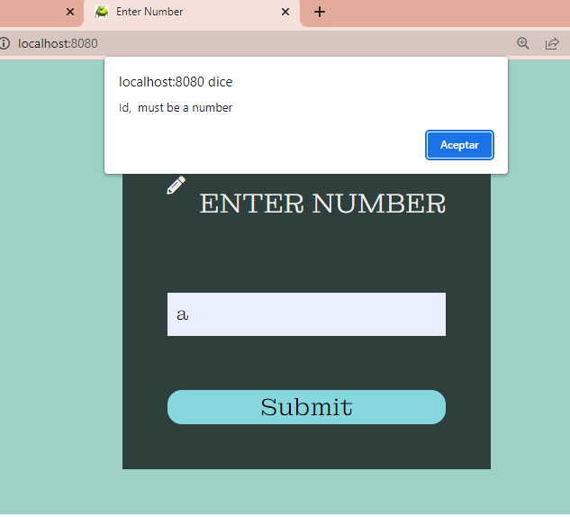
20. Recompile y ejecute la aplicación. Abra en su navegador en la página del formulario, y rectifique que la página hecha anteriormente sea mostrada.
    Ingrese los datos y verifique los resultados. Cambie el formulario para que ahora en lugar de POST, use el método GET . Qué diferencia observa?

* Cuando se hace con GET: Encontramos que se retorna la página con los valores del todo del id ingresado.
* Cuando se hace con POST:


21. ¿Qué se está viendo? Revise cómo están implementados los métodos de la clase Service.java para entender el funcionamiento interno


#### PARTE IV
1. Al proyecto Maven, debe agregarle las dependencias mas recientes de javax.javaee-api, com.sun.faces.jsf-api, com.sun.faces.jsf-impl,
   javax.servlet.jstl y Primefaces (en el archivo pom.xml).

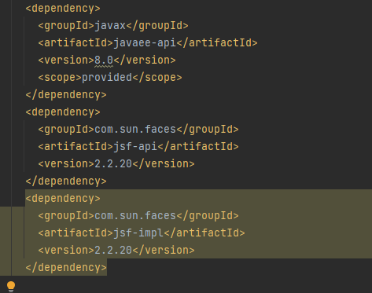

2. Para que configure automáticamente el descriptor de despliegue de la aplicación (archivo web.xml), de manera que el framework JSF se active al inicio
   de la aplicación, en el archivo web.xml 
3. Revise cada una de las configuraciones agregadas anteriormente para saber qué hacen y por qué se necesitan. Elimine las que no se necesiten.
---TODO: DEFINIR DEFINICIONES---
4. Ahora, va a crear un Backing-Bean de sesión, el cual, para cada usuario, mantendrá de lado del servidor las siguientes propiedades:
   a. El número que actualmente debe adivinar (debe ser un número aleatorio).
   b. El número de intentos realizados.
   c. El premio acumulado hasta el momento.
   d. El estado del juego, que sería una cadena de texto que indica si ya ganó o no, y si ganó de cuanto es el premio.

