# LABORATORIO #5:
### Integrantes: Wilson Delgado, Juanita Oramas

#### PARTE I
1. Abra una terminal Linux o consola de comandos Windows.
2. Realice una conexión síncrona TCP/IP a través de Telnet al siguiente servidor:
   Host: www.escuelaing.edu.co
   Puerto: 80
   Teniendo en cuenta los parámetros del comando telnet:
    ~~~
    telnet HOST PORT
    ~~~


3. Antes de que el servidor cierre la conexión por falta de comunicación:
   Revise la página 36 del RFC del protocolo HTTP, sobre cómo realizar una petición GET. Con esto, solicite al servidor el recurso ‘sssss/abc.html’,
   usando la versión 1.0 de HTTP.
   Asegúrese de presionar ENTER dos veces después de ingresar el comando.
   Revise el resultado obtenido. ¿Qué codigo de error sale?, revise el significado del mismo en la lista de códigos de estado HTTP.
   
   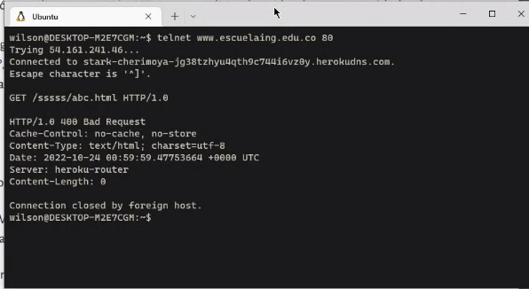
   ¿Qué otros códigos de error existen?, ¿En qué caso se manejarán?
   Sale error código 400, el servidor no procesa el "request" por un error del cliente
    
    Se tienen los códigos:
   * 1XX : indican información
   * 2XX : indican success 
   * 3XX : indican redirección
   * 4XX : indican error del cliente
   * 5XX : indican error del servidor

De error 4XX se tiene: 401 (No autorizado), 402 (Pago requerido), 403(Prohibido), 404 (No encontrado), 444 (No respuesta)
De error 5XX se tiene: 500 (Error interno del servidor), 502(Bad Gateway), 503(Servicio no disponible)


4. Realice una nueva conexión con telnet, esta vez a:
   Host: www.httpbin.org
   Puerto: 80
   Versión HTTP: 1.1
   Ahora, solicite (GET) el recurso /html. ¿Qué se obtiene como resultado?
   
    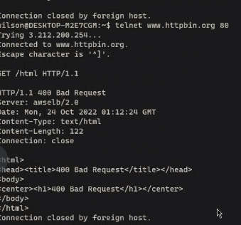
5. Seleccione el contenido HTML de la respuesta y copielo al cortapapeles CTRL-SHIFT-C. Ejecute el comando wc (word count) para contar palabras con la
   opción -c para contar el número de caracteres:
   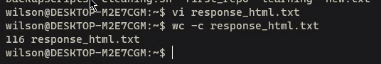
   Claro está, las peticiones GET son insuficientes en muchos casos. Investigue: ¿Cuál es la diferencia entre los verbos GET y POST? ¿Qué otros tipos de
   peticiones existen?
   * GET vs POST: 
     * Con GET lo usamos para la obtención de datos y POST para enviarlos al servidor.
     * GET permite ver la data que enviamos en la URL mientras que POST ofrece mayor seguridad y no permite esto.
   * PUT: Usado para actualizar datos. 
   * DELETE: Usado para eliminar datos.


6. En la practica no se utiliza telnet para hacer peticiones a sitios web sino el comando curl con ayuda de la linea de comandos
   ~~~
   curl www.httpbin.org
   ~~~

   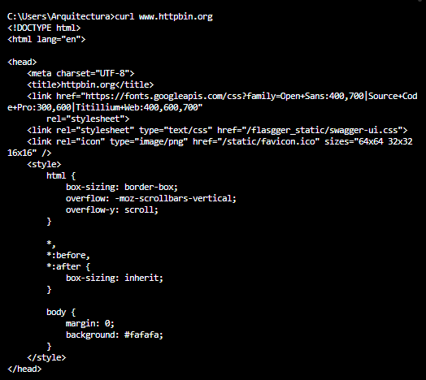
   Utilice ahora el parámetro -v y con el parámetro -i:
   ~~~
   curl -v www.httpbin.org
   curl -i www.httpbin.org
   ~~~
   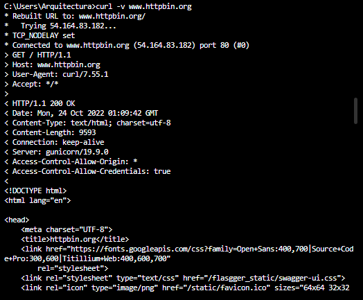
   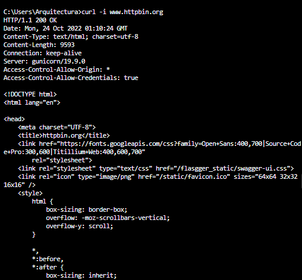
¿Cuáles son las diferencias con los diferentes parámetros?
* Para -v: muestra más información sobre la petición como la versión usada de curl, protocolos, puertos.
* Para -i:  incluye los headers HTTP.

#### PARTE II
1. Revise la clase SampleServlet
   Revise qué valor tiene el parámetro ‘urlPatterns’ de la anotación @WebServlet, pues este indica qué URLs atiende las peticiones el servlet.

* Atiende las urls ```urlPatterns = "/helloServlet"```
2. En el pom.xml, modifique la propiedad "packaging" con el valor "war". Agregue la siguiente dependencia
3. Revise en el pom.xml para qué puerto TCP/IP está configurado el servidor embebido de Tomcat (ver sección de plugins).
* Está configurado en el puerto 8080 
4. Compile y ejecute la aplicación en el servidor embebido Tomcat, a través de Maven con:
```
 mvn package
 mvn tomcat7:run
 ```
5. Abra un navegador, y en la barra de direcciones ponga la URL con la cual se le enviarán peticiones al ‘SampleServlet’. Tenga en cuenta que la URL tendrá
como host ‘localhost’, como puerto, el configurado en el pom.xml y el path debe ser el del Servlet. Debería obtener un mensaje de saludo.

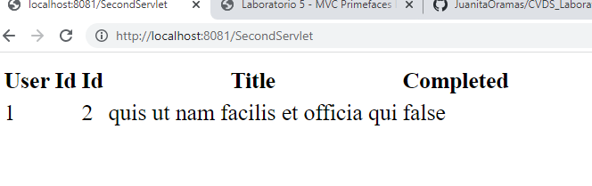

6. Observe que el Servlet ‘SampleServlet’ acepta peticiones GET, y opcionalmente, lee el parámetro ‘name’. Ingrese la misma URL, pero ahora agregando
un parámetro GET (si no sabe como hacerlo, revise la documentación en http://www.w3schools.com/tags/ref_httpmethods.asp).

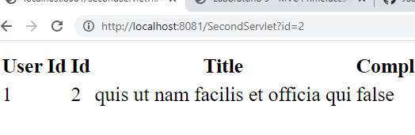

7. Busque el artefacto gson en el repositorio de maven y agregue la dependencia.

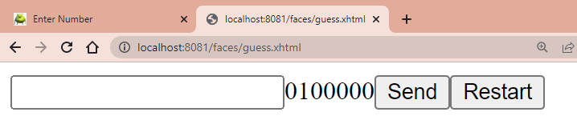

8. En el navegador revisé la dirección https://jsonplaceholder.typicode.com/todos/1. Intente cambiando diferentes números al final del path de la url.


9.  Basado en la respuesta que le da el servicio del punto anterior, cree la clase edu.eci.cvds.servlet.model.Todo con un constructor vacío y los
    métodos getter y setter para las propiedades de los "To Dos" que se encuentran en la url indicada.
10. Utilice la siguiente clase para consumir el servicio que se encuentra en la dirección url del punto anterior:


11. Cree una clase que herede de la clase HttpServlet (similar a SampleServlet), y para la misma sobrescriba el método heredado doGet. Incluya la
    anotación @Override para verificar –en tiempo de compilación- que efectivamente se esté sobreescribiendo un método de las superclases.
12. Para indicar en qué URL el servlet interceptará las peticiones GET, agregue al método la anotación @WebServlet, y en dicha anotación, defina la
    propiedad urlPatterns, indicando la URL (que usted defina) a la cual se asociará el servlet.


13. Teniendo en cuenta las siguientes métodos disponibles en los objetos ServletRequest y ServletResponse recibidos por el método doGet:

14. Una vez hecho esto, verifique el funcionamiento de la aplicación, recompile y ejecute la aplicación.

15. Intente hacer diferentes consultas desde un navegador Web para probar las diferentes funcionalidades.
* Pruebas exitosas:


* Pruebas donde debería responder con error:


#### PARTE III
16. En su servlet, sobreescriba el método doPost, y haga la misma implementación del doGet.

17. Cree el archivo index.html en el directorio src/main/webapp/index.html

18. En la página anterior, cree un formulario que tenga un campo para ingresar un número (si no ha manejado html antes, revise
    http://www.w3schools.com/html/ ) y un botón. El formulario debe usar como método ‘POST’, y como acción, la ruta relativa del último servlet creado
    (es decir la URL pero excluyendo ‘http://localhost:8080/’).

19. Revise este ejemplo de validación de formularios con javascript y agruéguelo a su formulario, de manera que -al momento de hacer ‘submit’- desde el
    browser se valide que el valor ingresado es un valor numérico.

20. Recompile y ejecute la aplicación. Abra en su navegador en la página del formulario, y rectifique que la página hecha anteriormente sea mostrada.
    Ingrese los datos y verifique los resultados. Cambie el formulario para que ahora en lugar de POST, use el método GET . Qué diferencia observa?

* Cuando se hace con GET: Encontramos que se retorna la página con los valores del todo del id ingresado. En la URL se evidencia que se muestra el id ingresado directamente.


* Cuando se hace con POST: En la URL se evidencia que no se muestra el id ingresado directamente.


21. ¿Qué se está viendo? Revise cómo están implementados los métodos de la clase Service.java para entender el funcionamiento interno
Se está evidenciando una tabla con la información del todo del id que enviamos.

#### PARTE IV
1. Al proyecto Maven, debe agregarle las dependencias mas recientes de javax.javaee-api, com.sun.faces.jsf-api, com.sun.faces.jsf-impl,
   javax.servlet.jstl y Primefaces (en el archivo pom.xml).


2. Para que configure automáticamente el descriptor de despliegue de la aplicación (archivo web.xml), de manera que el framework JSF se active al inicio
   de la aplicación, en el archivo web.xml 
3. Revise cada una de las configuraciones agregadas anteriormente para saber qué hacen y por qué se necesitan. Elimine las que no se necesiten.
   javax.javaee-api: API de java EE
   com.sun.faces.jsf-api: API de Java Server Faces
   com.sun.faces.jsf-impl: Implementación con clases concretas de la API de Java Server Faces
   javax.servlet.jstl: Tags especiales para el html

4. Ahora, va a crear un Backing-Bean de sesión, el cual, para cada usuario, mantendrá de lado del servidor las siguientes propiedades:
   a. El número que actualmente debe adivinar (debe ser un número aleatorio).
   b. El número de intentos realizados.
   c. El premio acumulado hasta el momento.
   d. El estado del juego, que sería una cadena de texto que indica si ya ganó o no, y si ganó de cuanto es el premio.
5. Cree una página XHTML, de nombre guess.xhtml (debe quedar en la ruta src/main/webapp). Revise en la página 13 del manual de PrimeFaces, qué
   espacios de nombres XML requiere una página de PrimeFaces y cuál es la estructura básica de la misma
6. Con base en lo anterior, agregue un formulario con identificador guess_form con el siguiente contenido básico:
7. Al formulario, agregue:
   a. Un elemento de tipo <p:outputLabel> para el número que se debe adivinar, sin embargo, este elemento se debe ocultar. Para ocultarlo, se
   puede agregar el estilo display: none; al elemento. Una forma de hacerlo es por medio de la propiedad style.
   En una aplicacion real, no se debería tener este elemento, solo se crea con el fin de simplificar una prueba futura.
   b. Un elemento <p:inputText> para que el usuario ingrese su número.
   c. Un elemento de tipo <p:outputLabel> para mostrar el número de intentos realizados.
   d. Un elemento de tipo <p:outputLabel> para mostrar el estado del juego.
   e. Un elemento de tipo <p:outputLabel> para mostrar en cuanto va el premio.

8. Al formulario, agregue dos botones de tipo <p:commandButton>, uno para enviar el número ingresado y ver si se atinó, y otro para reiniciar el juego.


9. Para verificar el funcionamiento de la aplicación, agregue el plugin tomcat-runner dentro de los plugins de la fase de construcción (build). Tenga en
   cuenta que en la configuración del plugin se indica bajo que ruta quedará la aplicación:


10. Si todo funcionó correctamente, realice las siguientes pruebas:
    a. Abra la aplicación en un explorador. Realice algunas pruebas con el juego e intente adivinar el número.
    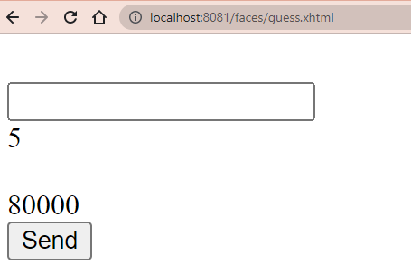
    b. Abra la aplicación en dos computadores diferentes. Si no dispone de uno, hágalo en dos navegadores diferentes (por ejemplo Chrome y Firefox;
    incluso se puede en un único navegador usando una ventana normal y una ventana de incógnito / privada). Haga cinco intentos en uno, y luego
    un intento en el otro. ¿Qué valor tiene cada uno?
    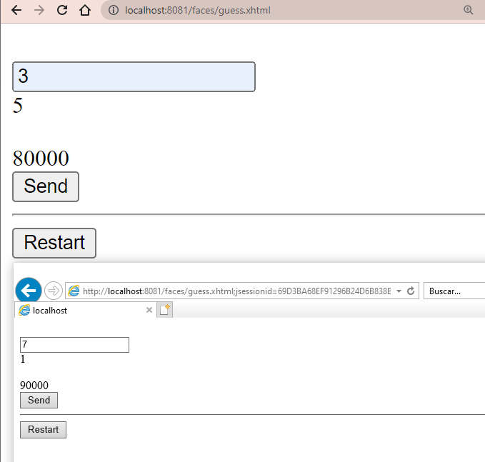
    c. Aborte el proceso de Tomcat-runner haciendo Ctrl+C en la consola, y modifique el código del backing-bean de manera que use la anotación
    @SessionScoped en lugar de @ApplicationScoped. Reinicie la aplicación y repita el ejercicio anterior.
    * ¿Coinciden los valores del premio?.
      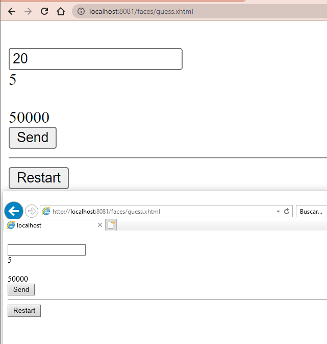
    * Dado la anterior, ¿Cuál es la diferencia entre los backing-beans de sesión y los de aplicación?
    Con session scope se tiene la información de las variables para cada usuario, en cambio en application scope la información del estado de las variables está para todos los usuarios. 
    d. Por medio de las herramientas de desarrollador del explorador (Usando la tecla "F12" en la mayoría de exploradores):
    * Ubique el código HTML generado por el servidor.
    * Busque el elemento oculto, que contiene el número generado aleatoriamente.
    * En la sección de estilos, deshabilite el estilo que oculta el elemento para que sea visible.
    
    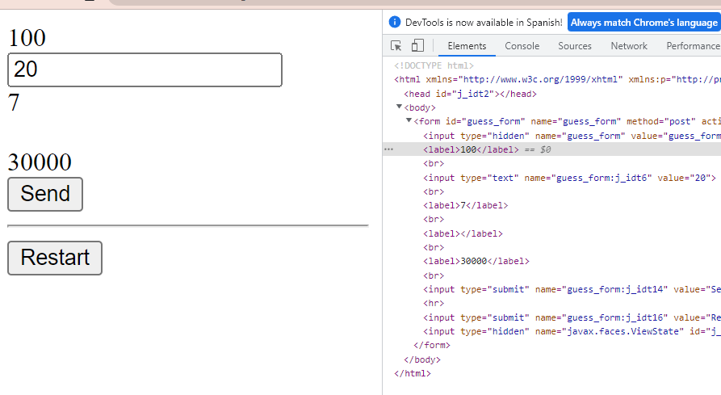
    
    * Observe el cambio en la página, cada vez que se realiza un cambio en el estilo.
    Al realizar un cambio, se ve inmediatamente reflejado.
    * Revise qué otros estilos se pueden agregar a los diferentes elementos y qué efecto tienen en la visualización de la página.
    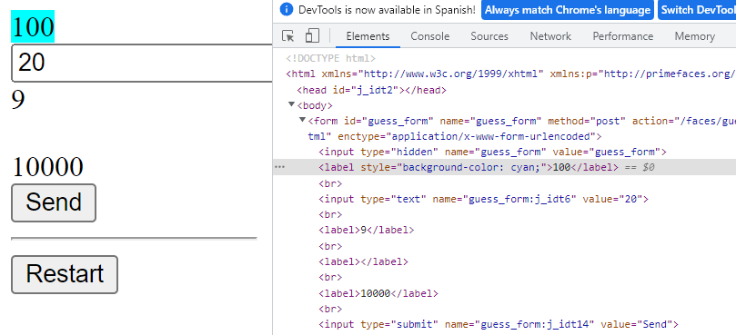
    * Actualice la página. Los cambios de estilos realizados desaparecen, pues se realizaron únicamente en la visualización, la respuesta del
    servidor sigue siendo la misma, ya que el contenido de los archivos allí almacenados no se ha modificado.
    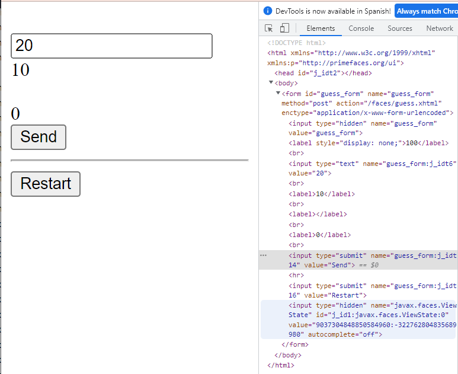
    * Revise qué otros cambios se pueden realizar y qué otra información se puede obtener de las herramientas de desarrollador.
    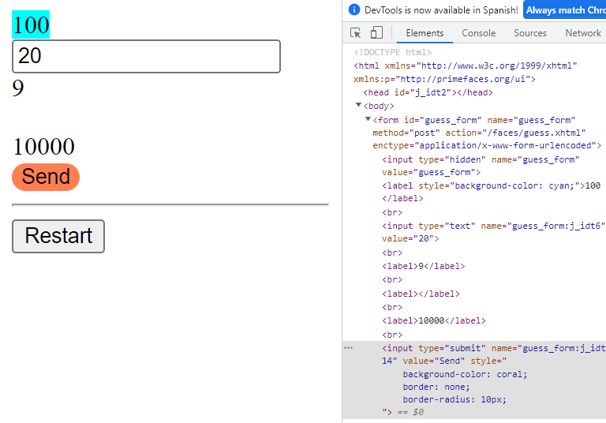